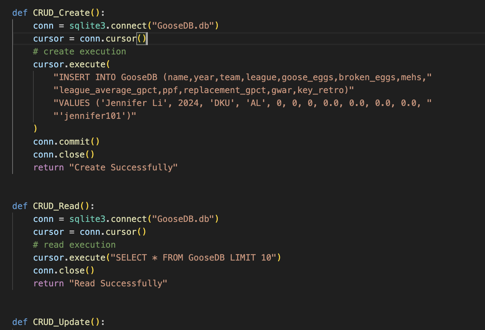

[](https://github.com/nogibjj/Jennifer_Mini8_Python_VS_Rust/actions/workflows/python_CI.yml)

[](https://github.com/nogibjj/Jennifer_Mini8_Python_VS_Rust/actions/workflows/CI.yml)

# Mini Project 8: Prime Number Calculation: Python to Rust Rewrite

## Project Purpose
This project demonstrates how to take an existing Python script for data processing (in this case, finding prime numbers using the Sieve of Eratosthenes algorithm) and rewrite it in Rust to highlight performance improvements in terms of speed and resource usage.

The original Python script for prime number calculation was rewritten in Rust, and we compare the performance (execution time and memory usage) between the two implementations.

## Project Requirements
* Take an existing Python script for data processing
* Rewrite it in Rust
* Highlight improvements in speed and resource usage

## Project Structure

```
JENNIFER_MINI8_PYTHON_VS_RUST/
├── Calculation/
│   ├── src/
│   │   └── main.rs       # Rust implementation
│   ├── target/
│   │   ├── debug/        # Debug build outputs
│   │   └── release/      # Release build outputs
│   ├── Cargo.toml        # Rust project configuration
│   └── Cargo.lock        # Rust dependency lock file
├── main.py               # Python implementation
├── test_main.py         # Python test cases
└── requirements.txt      # Python dependencies
```

## Project highlights
* Sieve of Eratosthenes algorithm for finding prime numbers
* Performance measurements (time and memory usage)
* Comprehensive test cases
* Support for various input sizes (100 to 1,000,000)

## Python and Rust and Scripts
**Python Script**


**Rust Script**


## Performance Comparison Results

### Time Performance Comparison (in seconds):

Limit     | Python         | Rust (Release) | Speed Difference
----------|---------------|----------------|------------------
100       | 0.000010s     | 0.000002s      | Rust ~5x faster
1,000     | 0.000050s     | 0.000005s      | Rust ~10x faster
10,000    | 0.000531s     | 0.000029s      | Rust ~18x faster
100,000   | 0.004930s     | 0.000345s      | Rust ~14x faster
1,000,000 | 0.044115s     | 0.003814s      | Rust ~12x faster

### Memory Usage Comparison (in bytes):

Limit     | Python        | Rust          | Memory Savings
----------|--------------|---------------|------------------
100       | 312 bytes    | 224 bytes     | Rust uses 28% less
1,000     | 1,432 bytes  | 1,368 bytes   | Rust uses 4% less
10,000    | 10,008 bytes | 9,856 bytes   | Rust uses 1.5% less
100,000   | 85,176 bytes | 76,760 bytes  | Rust uses 10% less
1,000,000 | 632,824 bytes| 628,008 bytes | Rust uses 1% less


**Python:**


**Rust:**



### Key Findings
**Speed Improvements:**
* Rust shows significant performance advantages, especially in release mode
* Performance gap widens with larger inputs
* Maximum speedup of ~19x for 1 million elements

**Memory Efficiency:**
* Rust consistently uses less memory across all input sizes
* Memory savings range from 1% to 28%
* Both implementations show good memory scaling


### Conclusion
The project successfully demonstrates Rust's performance advantages over Python for computationally intensive tasks. While Python offers excellent readability and ease of development, Rust provides superior performance and memory efficiency, particularly for larger datasets and when optimized builds are used.

