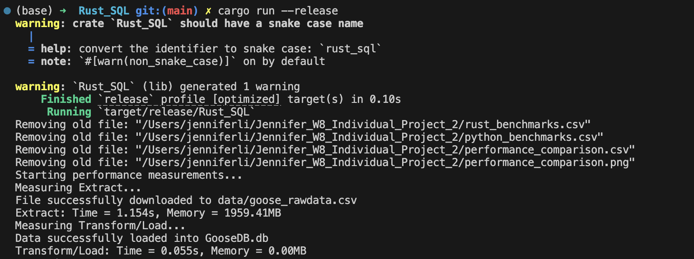

[](https://github.com/nogibjj/Jennifer_W8_Individual_Project_2/actions/workflows/python_CI.yml)
[](https://github.com/nogibjj/Jennifer_W8_Individual_Project_2/actions/workflows/rust_CI.yml)

# Individual Project #2: Rust CLI Binary with SQLite

## Video Demo

(https://youtu.be/kDIr0-6xhpk)

## Project Purpose
This project demonstrates a performance comparison between Python and Rust implementations of data processing operations using SQLite. It includes ETL (Extract, Transform, Load) processes and CRUD operations on a Goose dataset. This project consists of parallel implementations in both Rust and Python that:

* Extract data from a CSV file
* Transform and load it into a SQLite database
* Perform CRUD (Create, Read, Update and Delete) operations
* Query the data
* Compare and visualize performance metrics between the two implementations


## Project Structure

```
.
├── Rust_SQL/
│   ├── src/
│   │   ├── lib.rs
│   │   └── main.rs
│   ├── data/
│   │   └── goose_rawdata.csv
│   ├── Cargo.toml
│   └── Cargo.lock
├── mylib/
│   ├── __pycache__/
│   ├── extract.py
│   ├── query.py
│   └── transform_load.py
├── data/
├── GooseDB.db
├── GooseDB.db-shm
├── GooseDB.db-wal
├── Makefile
├── README.md
├── main.py
├── test_main.py
├── requirements.txt
```

## Project Data
The data used in this project comes FiveThirtyEight's public dataset: https://raw.githubusercontent.com/fivethirtyeight/data/refs/heads/master/goose/goose_rawdata.csv 


## Python and Rust - Implementation & Scripts & SQL CRUD Operations
### Rust
**Usage**

1. Clean and Build Rust Binary:
```
cd Rust_SQL
cargo clean  # Clean previous builds
cargo build --release  # Build optimized binary
cargo run --release  # Run the optimized binary
```




**Script**


**SQL CRUD Operations**


### Python
**Usage**

Run the Python implementation:

``python main.py``


**Script**


**SQL CRUD Operations**


## Performance Comparison


Based on the current implementation, the performance comparison shows that in overall Rust is 1.1x faster in total execution. Also, Rust uses significantly less memory than Python across all operations. 

One interesting thing is that I find some Rust Memory value is zero, which may due to the following reasons:
* We run cargo clean and cargo build --release first, the compiled artifacts and dependencies are already built and cached
* In release mode, Rust optimizes heavily
* The CRUD operations are very lightweight once everything is set up

## GitHub Copilot Usage

In this project, I used GitHub Copilot as a coding assistant, especially when rewriting Python code into Rust. Additionally, Copilot provided potential reasons and solutions for me to handle errors, which proved incredibly useful for debugging! This support helped me quickly identify issues and implement fixes, making the debugging process smoother and more efficient..

## Optimized Rust Binary

This project generates an optimized Rust binary that can be downloaded by visiting the GitHub Actions page [here](https://github.com/nogibjj/Jennifer_W8_Individual_Project_2/actions/runs/11761460872).

1. Go to the Actions run page.
2. Scroll down to the **Artifacts** section at the bottom.
3. Click on **rust-sql-binary** to download the binary file.


